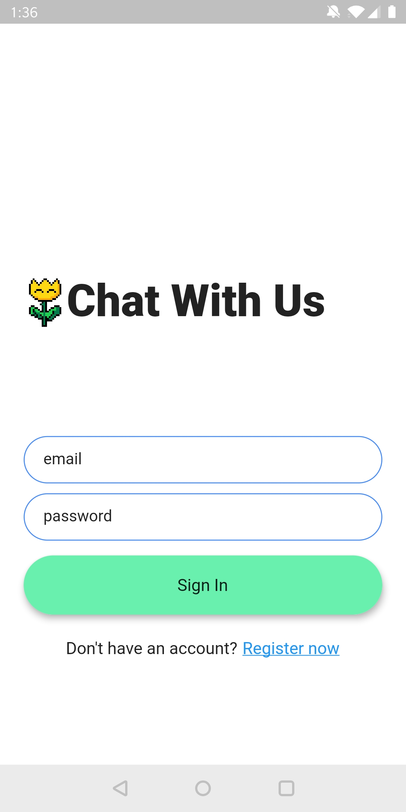
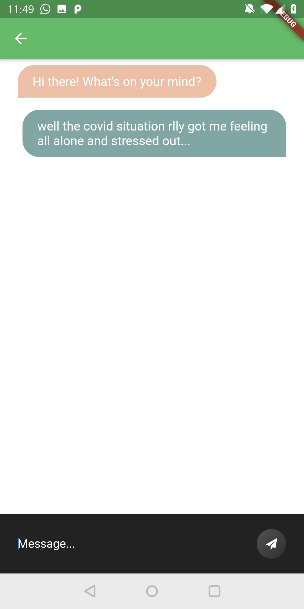

# HeartToHeart
A 3-day CODE_EXP hackathon organised by DSTA.

Our(team of 4) app Heart-to-Heart(HtH) is built using Flutter.

Due to the recent covid 19 pandemic, we aim to strengthen Singaporeans' mental resilience against this and any future pandemic that may happen.

HtH has 3 main functions, in-app chat with professionals, dashboard of helpful articles and a list of hotline numbers. More info can be found in the ReadMe.txt file.
We used Firebase and Firestore for authentication and cloud-based storage.

A glimpse of our app:
| |  |
|--|--|
| ||
More images can be found in the appImg folder.
